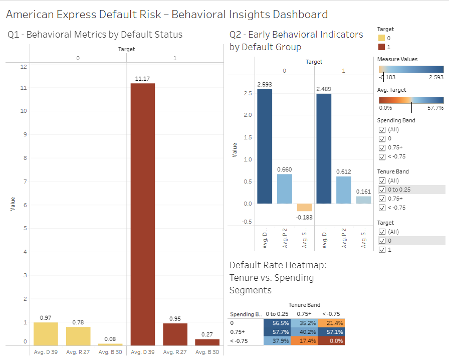

# American-Express-Default-Risk

# 💳 American Express Default Risk Dashboard

### Identifying behavioral trends, early risk signals, and customer segmentation insights using SQL and Tableau.

This project analyzes customer behavior and financial attributes to understand default risk trends in American Express data. Insights were developed using SQL, cleaned via Python, and visualized with a stakeholder-ready Tableau dashboard.

---

## 🧾 Executive Summary

This dashboard addresses three strategic risk and customer profiling questions:

1. **Which behavioral patterns or customer segments are most associated with default risk?**
2. **Are there any early behavioral indicators that consistently predict default before it occurs?**
3. **How does the overall credit health of our portfolio vary by customer tenure and spending?**

### 📊 Dashboard Overview

- Visual insights include:
  - Default likelihood by key behavioral features (`D_39`, `B_30`, `P_2`)
  - Risk trends across customer tenure and average transaction value
  - Indicators that change over time prior to default events



---

### ✅ Actionable Recommendations

- **🛡 Risk Team Insight:* These can serve as triggers for internal alerts or preemptive outreach.**
  - Monitor behavioral indicators like `D_39`, `P_2`, and `B_30` for early signs of risk.
    
- **💰 Finance Insight:* Supports refining credit exposure and limit management policies.**
  - Target customers with short tenure and low average spend for account review.

- **📣 Marketing Insight:* Improve LTV by nurturing customer groups that show long-term potential.**
  - Build retention campaigns for low-risk, mid-tenure customers who show positive engagement metrics.

- **🧠 Data Science Insight:* Indicators like volatility in `B_30` can enhance churn or risk prediction models.**
  - Use pattern deviation as input into predictive models. 

---

## 🔍 Deep Dive: Analytical Approach

### 🧮 Dataset Overview
- 100,000-record sample from American Express default prediction dataset
- ~190 anonymized behavioral and financial variables
- Data collected across time steps for each customer ID

### 💾 SQL-Based Analysis
- Wrote custom `CREATE TABLE` schema to structure anonymized variables
- Used MySQL to:
  - Segment customers by tenure, spending, and risk metrics
  - Identify high-risk groups based on key features
  - Correlate behavioral indicators with default outcome

### 📊 Tableau Visualizations
- **Bar charts:** Segment-level default trends
- **Box plots:** Risk scores by tenure and utilization
- **Line plots:** Pre-default indicator drop-off visualization

---

## 🔗 Data Source

🔗 [Download via Google Drive](./data/cleaned_dataset_link.md) 

---

## 🛠️ Tools Used

- **SQL (MySQL dialect):** Schema setup and data exploration
- **Tableau Public:** Executive dashboard creation
- **Google Colab + Drive:** Dataset preparation and large file handling

---

## 📁 Repository Structure

```
amex-default-risk/
│
├── data/
│   ├── data_source.md                  # Link and description of original Kaggle dataset
│   └── cleaned_dataset_link.md         # External link to cleaned 100k-row CSV
│
├── sql/
│   ├── amex_create_table.sql           # Table schema setup
│   ├── amex_query_1.sql                # Segment default risk analysis
│   ├── amex_query_2.sql                # Early indicator analysis
│   └── amex_query_3.sql                # Portfolio credit health analysis
│
├── images/
│   └── dashboard_preview.png           # Tableau dashboard preview
│
├── README.md                           # Project documentation
└── LICENSE                             # Repository license
```
